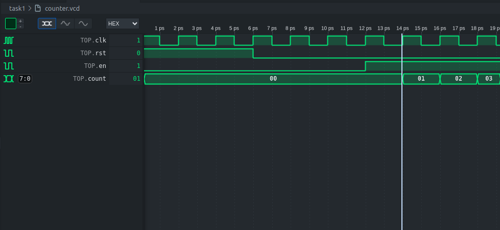
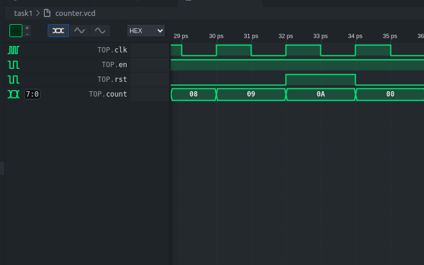
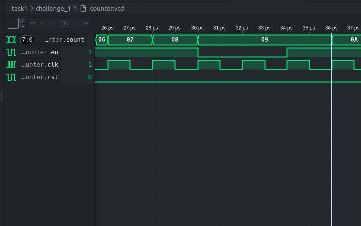
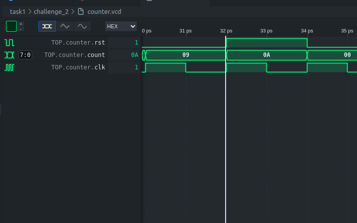
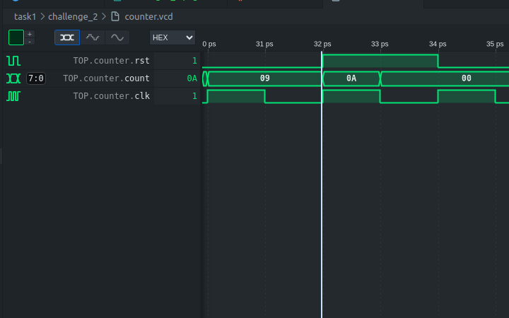

# Task 1

**Why is the time axis in ps? Does it matter?**

The time axis being in ps does not matter - since verilator is cycle accruate, it does not consider time, one the changes that occur each time the clock changes.

The key results of simulation is shown below:




- After clock cycle 5, at the start of clock cycle 6, en = 1
- Since the condition for en is that the clock cycle must be > 4. 
- Output is determined by the input just before the rising edge, on clock cycle 7, the count increments.


- since i == 15 sets rst = 1 -> after clock cycle 15, rst = 1
- since the output is determined by the input before the rising edge, count resets on clock cycle 17


## Challenge 1

Image shows 3 cycle pause when count = 9


main logic in test bench added:

``` c++
if((int)top->count == 9 && pause < 2){
    top->en = 0;
    pause++;
}
else if(i > 4){
    top->en = 1;
    pause = 0;
}
```

Code performs following operation:
1. if count is at 9 and pause hasn't complete - 1 clock cycle of 9 has just happened - so increment pause.

2. if conditions for first have not been met and en is past the stage where it can be 0 -> pause must be reset and continue counting.


## Challenge 2

For Sync rst:


For Async rst:


- When async - output changes before next rising edge - it changes on the next clock change
- Since verilator is cycle accurate, it only checks for changes when the `eval()` function is called
- Change occurs half a clock cycle earlier than when an sync rst is used.