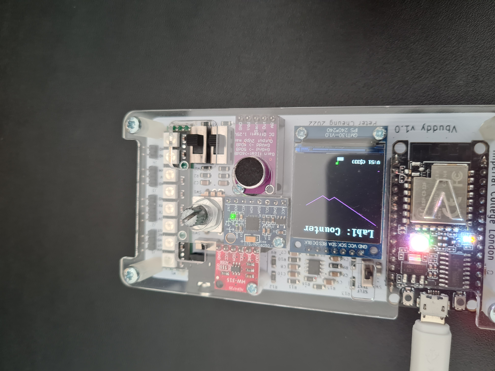
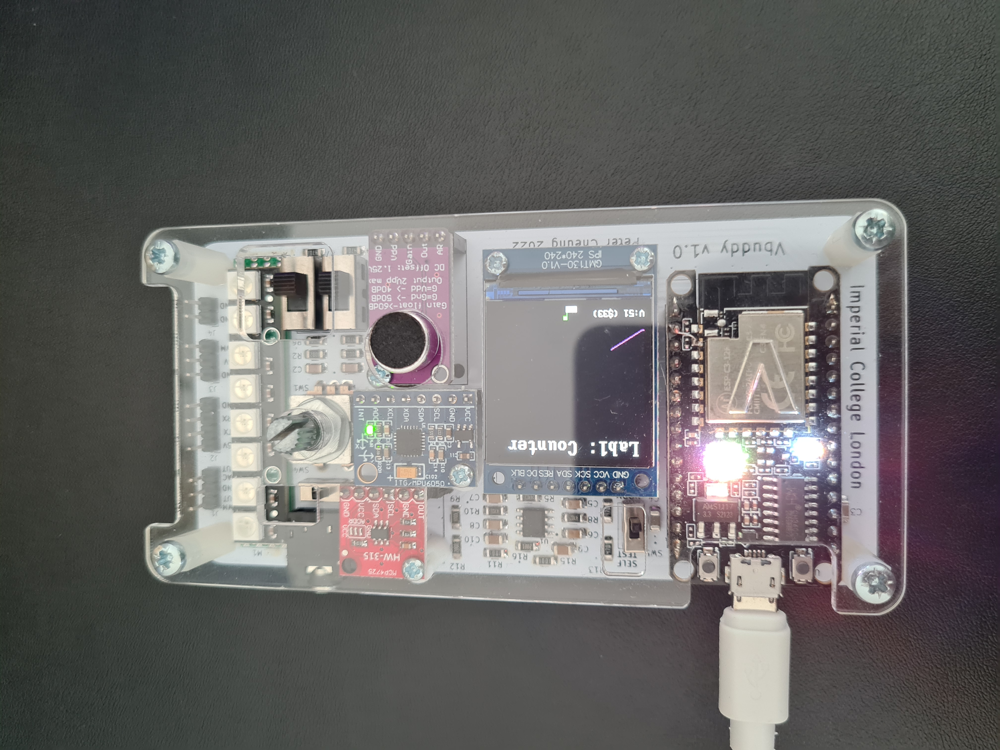

# Task 2

## Challenge

The images below show the graoh changing after the button was pressed.





This was accomplished by only editting the counter.sv file:
``` sv
always_ff @ (posedge clk)
    if(rst) count <= {WIDTH{1'b0}};  // when rst = 1 -> cout = 0000_0000
    else if(en) count <= count + {{WIDTH-1{1'b0}}, 1'b1}; // does count + 1 -> when en = 1
    else count <= count - {{WIDTH-1{1'b0}}, 1'b1};

```

When en = 1 -> it adds 1 to the count value.

Otherwise if en = 0, it takes away 1.

The en value is controlled by the flag: `top->en = vbdFlag();`